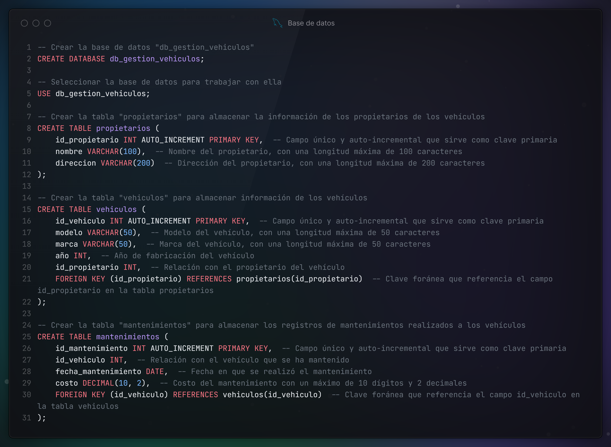
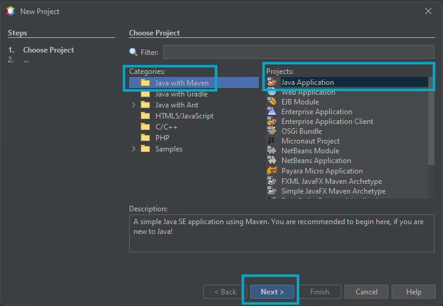
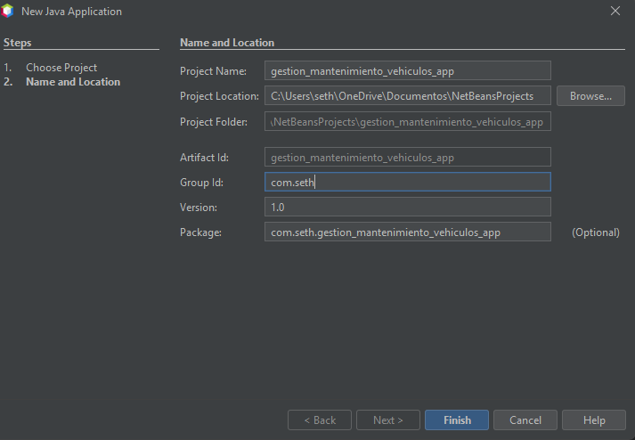
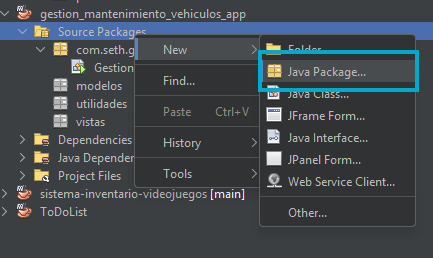
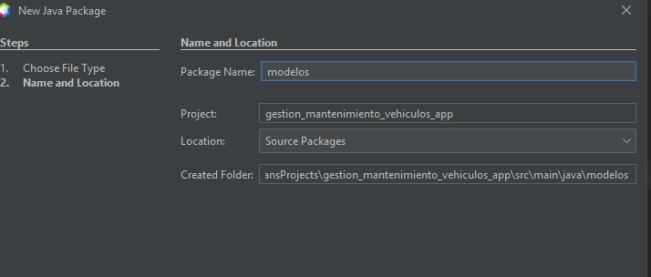
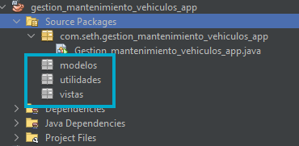

# Gestión de Mantenimiento de Vehículos - JAVA with Maven y MYSQL

## Objetivo

Crear la base de datos para gestionar el mantenimientos de vehículos MYSQL y posteriormente conectarlo con un lenguaje de programación de alto nivel

- [X] JAVA

## Requisitos

- [MySQL Con Workbench.](https://seth09work.notion.site/Instalaci-n-de-MySQL-Windows-11ca5eb0166c807e8b0ad80dd29c9132?pvs=74)
- Lenguaje de programación (**Java**) y su respectivo IDE de desarrollo.
  - [JAVA JDK 11 o Superior](https://www.oracle.com/java/technologies/javase/jdk17-archive-downloads.html)
  - [NetBeans en su versión 17 o superior](https://netbeans.apache.org/)

## Funcionalidades

- Conexión a MySQL: Puedes usar JDBC (Java Database Connectivity) para establecer la conexión con la base de datos MySQL. Crea una clase de utilidad para manejar la conexión.
- CRUD Básico: Implementa las operaciones de Crear, Leer, Actualizar y Eliminar (CRUD) para cada tabla.
- Interfaz de Usuario Simple: Puedes usar la consola o una interfaz gráfica sencilla con Swing para interactuar con los datos.
- Relaciones entre Tablas: Asegúrate de implementar las relaciones usando claves foráneas y los JOIN en tus consultas SQL.
 
## Guía de Desarrollo (Paso a Paso)

### Construcción de la base de datos

Para iniciar con la creación de la aplicación se deberá elaborar la base de datos que se utilizara.

#### 1. Creación de la base de datos

1. Abrir MySQL Workbench y conectarse a la instancia previamente creada.
2. Crear una nueva base de datos con el nombre "db_gestion_vehiculos".
3. Elabore las siguientes tablas:



#### 2. Creación y Configuración del proyecto - JAVA with Maven

- Ahora se deberá crear el proyecto utilizando el IDE Netbeans y seleccionado la categoría Java with MAVEN y la plantilla de proyecto Java Application a como se muestra imagen:
  
    

- En la siguiente ventana se colocara el nombre del proyecto el cual sera: **gestion_mantenimiento_vehiculos_app**, el group id puede dejarse a como esta por defecto y la version se establecerá en 1.0

    

- Posteriormente se deberá agregar 3 paquetes al proyecto, los cuales serán: Vistas, Modelos y Utilidades, se ilustra como se creara uno de ellos y los para los demás se deberá de repetir los pasos:

  - Clic derecho sobre la carpeta Source Packages -> NEW -> Java Package:
    

  - En la ventana que se despliega se colocara el nombre del paquete:
    

  - Luego de crear los otros dos paquete el proyecto tendrá la siguiente estructura:
     

- Ahora se deberá agregar la dependencia del driver de MySQL en el archivo pom.xml, para ello se deberá agregar el siguiente código dentro de este archivo:
Esto justo después de la etiqueta </properties> y antes de la etiqueta </project>

    ```xml
    <dependencies>
        <!-- JDBC de MYSQL para la conexión a la base de datos -->
        <dependency>
            <groupId>com.mysql</groupId>
            <artifactId>mysql-connector-j</artifactId>
            <version>8.4.0</version>
        </dependency>

        <!-- Look and Feel -->
        <dependency>
            <groupId>com.formdev</groupId>
            <artifactId>flatlaf</artifactId>
            <version>3.5.2</version>
        </dependency>
     
    </dependencies>
    ```

- 